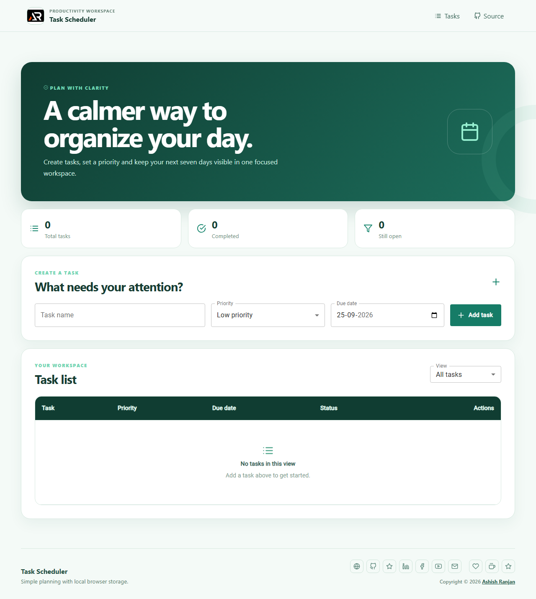

# Task Scheduler

Task Scheduler is a focused React productivity app for creating tasks, assigning priorities and organizing due dates for the next seven days. Tasks are stored in the browser's local storage, so the workspace remains available between visits.

## Features

- Create tasks with a priority and due date
- Filter all, open, completed and priority-based tasks
- Mark tasks complete or delete them with confirmation
- Responsive fixed header, mobile menu and floating go-to-top button
- Local browser storage with a clean, responsive interface

## Tech stack

React, Create React App, Material UI, Sass modules, React Icons, SweetAlert2 and React Toastify.

## Run locally

    git clone https://github.com/a2rp/task-scheduler.git
    cd task-scheduler
    npm install
    npm start

## Deployment

Live: [https://a2rp.github.io/task-scheduler/](https://a2rp.github.io/task-scheduler/)

Deploy with:

    npm run deploy

## Links

- Portfolio: [https://www.ashishranjan.net/](https://www.ashishranjan.net/)
- GitHub: [https://github.com/a2rp](https://github.com/a2rp)
- CodePen: [https://codepen.io/ash1198](https://codepen.io/ash1198)
- LinkedIn: [https://www.linkedin.com/in/aashishranjan](https://www.linkedin.com/in/aashishranjan)
- Facebook: [https://www.facebook.com/theash.ashish/](https://www.facebook.com/theash.ashish/)
- YouTube: [https://www.youtube.com/@ashishranjan-ashz?sub_confirmation=1](https://www.youtube.com/@ashishranjan-ashz?sub_confirmation=1)
- Email: [ash.ranjan09@gmail.com](mailto:ash.ranjan09@gmail.com)

## Support

- Support: [https://a2rp-donation-page.netlify.app/](https://a2rp-donation-page.netlify.app/)
- Buy Me a Coffee: [https://buymeacoffee.com/a2rp](https://buymeacoffee.com/a2rp)
- Patreon: [https://patreon.com/a2rp](https://patreon.com/a2rp)
